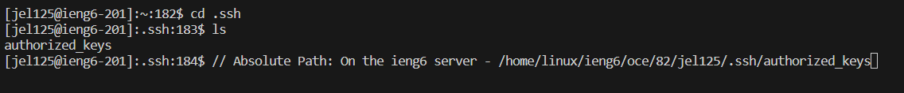

# Part 1 - ChatServer
## The Code of ChatServer

Note that since this is noted in the lab report instructions:

> You can assume that the s= parameter always comes before the user= parameter, and they are always separated by a & as shown above.

We do not have to check the elements of ```parameters``` for the correct ```"s="``` and ```"user="``` format.

```
import java.io.IOException;
import java.net.URI;

class Handler implements URLHandler {
    String chat = "";

    public String handleRequest(URI url) {
        if (url.getPath().equals("/")) {
            return String.format(chat);
        } else {
            if (url.getPath().contains("/add-message")) {
                String[] parameters = url.getQuery().split("&");
                // s=<string>, user=<string>
                String message = parameters[0].split("=")[1];
                String username = parameters[1].split("=")[1];
                chat += (username + ": " + message + "\n");
                return chat;
            }
            return "404 Not Found!";
        }
    }
}

class ChatServer {
    public static void main(String[] args) throws IOException {
        if(args.length == 0){
            System.out.println("Missing port number! Try any number between 1024 to 49151");
            return;
        }

        int port = Integer.parseInt(args[0]);

        Server.start(port, new Handler());
    }
}
```

## First Add Message


Methods called: The ```handleRequest```, ```contains```, ```getPath```, ```getQuery```, and ```split``` method are called.

Relevant arguments:

- ```handleRequest()``` is first called, taking in the ```url```.
- ```url.getPath()``` - To the ```getPath``` method called from ```url```, we just pass in no arguments. This method returns the path of the ```url``` we enter, which we chain with other methods below.
- ```url.getPath().contains``` - To the ```contains``` method called from the path we obtain from ```url.getPath()```, we pass in ```"/add-message"```, which is our only implemented path (aside from the default ```"/"``` that I've left in). This checks whether the path is the appropriate ```"/add-message"``` to add a message to our overall ```chat``` variable.
- ```url.getQuery()``` - To ```getQuery``` called from ```url```, we don't pass in any arguments as it just retrieves everything after ```?``` - the query of the ```url```. We chain this with the ```split``` method below.
- ```url.getQuery().split("&")```, ```parameters[0].split("=")```, ```parameters[1].split("=")``` - To the ```split``` method called from either the query we obtain from ```url.getQuery()``` or the two parts of the initial split we do, we pass in ```"&"``` or ```"="``` depending on what how we need to split the queries/query pieces to obtain the username or message. For example, we use ```split``` with ```"&"``` to first separate between the ```message``` part and the ```username``` part. Then we use ```split``` with ```"="``` to obtain the actual ```message``` and ```username```.

Fields:
The ```chat``` field is updated here with the username and message obtained from using split to split the query into pieces and formatted in the required format.
- Here it begins as an empty string: ```""``` as there was no previous input - the server just started!
- Then it is updated to become ```"jeremy: hi\n"``` after the request is handled by the ```handleRequest``` method and all the various methods above are called. ```"jeremy"``` is obtained as the username, and ```"hi"``` is obtained as the message. Then it is formatted into ```"jeremy: hi\n"``` and appended to the ```chat``` variable. The ```handleRequest``` method then returns the ```chat``` variable, which is displayed as the chat so far.
- The chat field goes from ```""``` to ```jeremy: hi\n"```

## Second Add Message


The methods called and the arguments passed in are basically identical to the first time we added a message to the chat, but the field ```chat``` starts, ends and is updated with a different value. The obtained ```username``` and ```message``` are also different.

Methods called: The ```handleRequest```, ```contains```, ```getPath```, ```getQuery```, and ```split``` method are called.

Relevant arguments:

- ```handleRequest()``` is first called, taking in the ```url```.
- ```url.getPath()``` - To the ```getPath``` method called from ```url```, we just pass in no arguments. This method returns the path of the ```url``` we enter, which we chain with other methods below.
- ```url.getPath().contains``` - To the ```contains``` method called from the path we obtain from ```url.getPath()```, we pass in ```"/add-message"```, which is our only implemented path (aside from the default ```"/"``` that I've left in). This checks whether the path is the appropriate ```"/add-message"``` to add a message to our overall ```chat``` variable.
- ```url.getQuery()``` - To ```getQuery``` called from ```url```, we don't pass in any arguments as it just retrieves everything after ```?``` - the query of the ```url```. We chain this with the ```split``` method below.
- ```url.getQuery().split("&")```, ```parameters[0].split("=")```, ```parameters[1].split("=")``` - To the ```split``` method called from either the query we obtain from ```url.getQuery()``` or the two parts of the initial split we do, we pass in ```"&"``` or ```"="``` depending on what how we need to split the queries/query pieces to obtain the username or message. For example, we use ```split``` with ```"&"``` to first separate between the ```message``` part and the ```username``` part. Then we use ```split``` with ```"="``` to obtain the actual ```message``` and ```username```.

Fields:
The ```chat``` field is updated here with the username and message obtained from using split to split the query into pieces and formatted in the required format.
- Here it begins as the string from before: ```"jeremy: hi\n"```
- Then it is updated to become with ```"another guy: hi how are you doing!\n"``` to become: ```"jeremy: hi\n another guy: hi how are you doing!\n"``` after the request is handled by the ```handleRequest``` method and all the various methods above are called. ```"another guy"``` is obtained as the username, and ```"hi how are you doing!"``` is obtained as the message. Then it is formatted into ```"another guy: hi how are you doing!\n"``` and appended to the ```chat``` variable. The ```handleRequest``` method then returns the ```chat``` variable, which is displayed as the chat so far.
- The chat field goes from ```"jeremy: hi\n"``` to ```"jeremy: hi\n another guy: hi how are you doing!\n"```

# Part 2
## The absolute path to the private key for your SSH key for logging into ieng6


The Absolute Path: ```C:\Users\jerem\.ssh\id_rsa```

## The absolute path to the public key for your SSH key for logging into ieng6



The Absolute Path: ```C:\Users\jerem\.ssh\id_rsa.pub```

## Logging in without a password


# Part 3

The most interesting thing I've learned by far in these weeks is how URLs are formatted and how websites process these URLs into paths, queries, and even parts of a query in order to process a great number of different things. I've noticed now how google searches happen through the same format that our simplistic programs run on, where you have a path then a query that is split and processed. In google's case, it's search?q=SEARCHTERM&SOMEOTHERSTUFF. 
