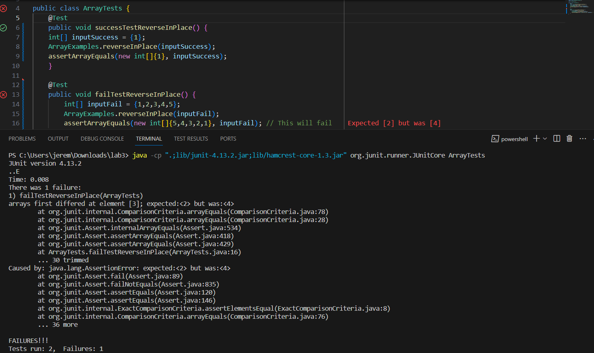

# Part 1 - Bugs

The directory used in this part is linked [here](https://github.com/ucsd-cse15l-f23/lab3). It's the directory used in lab 4.

If you are viewing this page from a pdf, use this link instead: https://github.com/ucsd-cse15l-f23/lab3

The bug that will be referenced in this section is a bug located in the ```reverseInPlace``` method in the ```ArrayExamples``` class. Here is the method's code copied from ```ArrayExamples.java```:

```
// Changes the input array to be in reversed order
static void reverseInPlace(int[] arr) {
  for(int i = 0; i < arr.length; i += 1) {
    arr[i] = arr[arr.length - i - 1];
  }
}
```

This method aims to return the **same** input array but in reverse order (i.e. fields that reference the input array will now reference the reversed array after the method is called).

However, there is a critical bug in the code. The ```for``` loop in the method body aims to assign elements at the beginning of the list with elements at the end of the list. For example, if we imagine that this method works as intended, when it is applied on a list such as ```{10,20,30,40,50}```, it will assign the last element in the list, ```50``` to the first element in the list, ```10```. Then ```i``` will be incremented by one, which causes the second element in the list to be replaced by the second-to-last element in the list, here it is the element ```20``` being replaced by ```40```. ```30``` remains unchanged, as the third element in the list and the third-to-last element in the list are the same element - ```30```. 

The next iteration of the loop is where the bug appears. The list thus far should look like this: ```{50,40,30,40,50}```

Now we can see the problem. What happens when we try to replace the fourth element in the list by the fourth-to-last element in the list? We end up replacing ```40``` with ```40```. The same happens for the fifth element in the list with the fifth-to-last element in the list, where we replace ```50``` with ```50```. We can see the symptom here: the list doesn't reverse properly after the "middle point" (for an odd-length list, this is just right after the median value, and for an even-length list, this is after the (length/2)-1 th value in the list).

The bug here is that in an attempt to reverse the list by replacing the values in the beginning of the list with the values at the end, we lose the data that was at the beginning of the list which we need to reverse the latter half of the array. To fix this, we can create a new array of the same length inside the method, replace the values of the new list instead, then replace the values in the original array with the values in the reversed array since we want to reverse it in place.

A failure inducing input for this bug would be: ```{1,2,3,4,5}```. A JUnit test for this could be structured like this:

```
@Test
public void failTestReverseInPlace() {
    int[] inputFail = {1,2,3,4,5};
    ArrayExamples.reverseInPlace(inputFail);
    assertArrayEquals(new int[]{5,4,3,2,1}, inputFail); // This will fail
}
```

An input that doesn't induce a failure despite the bug would be: ```{1}```. A Junit test for this could be structured like this:

```
@Test 
public void successTestReverseInPlace() {
    int[] inputSuccess = {1};
    ArrayExamples.reverseInPlace(inputSuccess);
    assertArrayEquals(new int[]{1}, inputSuccess);
}
```

## The Result of the Tests



## The fixed code

```
// Changes the input array to be in reversed order
static void reverseInPlace(int[] arr) {
  int[] newArr = new int[arr.length];
  for(int i = 0; i < arr.length; i += 1) {
    newArr[i] = arr[arr.length - i - 1];
  }
  for(int i = 0; i < arr.length; i += 1){
      arr[i] = newArr[i];
  }
}
```

# Part 2 - Researching Commands

The command I want to research here is the ```find``` command. All the information came from the website tldr.sh, which is a useful, shortened version of the ```man``` page for each command. You can find the webpage for the find command [here](https://tldr.inbrowser.app/pages/common/find)

Link for pdf viewers: https://tldr.inbrowser.app/pages/common/find

## Command Option 1 - ```-name```

Using ```find``` to find all files/directories that start with "chapter".

```
jerem@LAPTOP-RQSID7KS MINGW64 ~/downloads/docsearch/technical (main)
$ find . -name 'chapter*'
./911report/chapter-1.txt
./911report/chapter-10.txt
./911report/chapter-11.txt
./911report/chapter-12.txt
./911report/chapter-13.1.txt
./911report/chapter-13.2.txt
./911report/chapter-13.3.txt
./911report/chapter-13.4.txt
./911report/chapter-13.5.txt
./911report/chapter-2.txt
./911report/chapter-3.txt
./911report/chapter-5.txt
./911report/chapter-6.txt
./911report/chapter-7.txt
./911report/chapter-8.txt
./911report/chapter-9.txt
```

Using ```find``` to find all java files (files with the ```.java``` extension)

```
jerem@LAPTOP-RQSID7KS MINGW64 ~/Downloads/docsearch (main)
$ find . -name '*.java'
./DocSearchServer.java
./Server.java
./TestDocSearch.java
```

The -name command line option allows us to find all files that match a certain pattern in their name. Here, we search for all files that start with 'chapter' and also all java files - files that have the ```.java``` file extension. This is useful when we are trying to get a list of all files sorted by a certain pattern in their name, including their file extensions.

## Command Option 2 - ```type```

Using ```find``` to find all directories

```
jerem@LAPTOP-RQSID7KS MINGW64 ~/downloads/docsearch/technical (main)
$ find . -type d
.
./911report
./biomed
./government
./government/About_LSC
./government/Alcohol_Problems
./government/Env_Prot_Agen
./government/Gen_Account_Office
./government/Media
./government/Post_Rate_Comm
./plos
```

Using ```find``` to find all files under ```./technical/911report/```

```
jerem@LAPTOP-RQSID7KS MINGW64 ~/Downloads/docsearch (main)
$ find ./technical/911report/ -type f
./technical/911report/chapter-1.txt
./technical/911report/chapter-10.txt
./technical/911report/chapter-11.txt
./technical/911report/chapter-12.txt
./technical/911report/chapter-13.1.txt
./technical/911report/chapter-13.2.txt
./technical/911report/chapter-13.3.txt
./technical/911report/chapter-13.4.txt
./technical/911report/chapter-13.5.txt
./technical/911report/chapter-2.txt
./technical/911report/chapter-3.txt
./technical/911report/chapter-5.txt
./technical/911report/chapter-6.txt
./technical/911report/chapter-7.txt
./technical/911report/chapter-8.txt
./technical/911report/chapter-9.txt
./technical/911report/preface.txt
```

The ```-type``` command line option allows us to limit what the type of object ```find``` attempts to find - directories/files/contents. For example, here I search for all objects that are directories using the ```-type d``` flag. Then I use ```-type f``` to find all objects that are files (and not directories). This is useful if you want to find something inside a directory of a certain type, for example, files only or directories only.

## Command Option 3 - ```maxdepth```

Using ```find``` to find everything up to a max recursive depth of 1

```
jerem@LAPTOP-RQSID7KS MINGW64 ~/Downloads/docsearch (main)
$ find . -maxdepth 1
.
./.git
./DocSearchServer.java
./lib
./README.md
./Server.java
./technical
./TestDocSearch.java
```

Using ```find``` to find everything up to a max recursive depth of 2

```
jerem@LAPTOP-RQSID7KS MINGW64 ~/Downloads/docsearch (main)
$ find . -maxdepth 2
.
./.git
./.git/config
./.git/description
./.git/HEAD
./.git/hooks
./.git/index
./.git/info
./.git/logs
./.git/objects
./.git/packed-refs
./.git/refs
./DocSearchServer.java
./lib
./lib/hamcrest-core-1.3.jar
./lib/junit-4.13.2.jar
./README.md
./Server.java
./technical
./technical/911report
./technical/biomed
./technical/government
./technical/plos
./TestDocSearch.java
```

The ```find``` command recursively finds everything under all the directories of the directory we direct the command to. Using the ```maxdepth``` modifier allows us to limit how far the command searches by specifying a max recursive depth using the modifier. Here, I first search for everything up to a max recursive depth of 1, then up to a max recursive depth of 2.

## Command Option 4 - ```empty```

Using ```find``` to find all files that are empty (no content)

```
jerem@LAPTOP-RQSID7KS MINGW64 ~/Downloads/docsearch (main)
$ find . -empty
./.git/objects/info
./.git/refs/tags
./technical/911report/emptyfile.txt
```

Using ```find``` to find all **text** files that are empty (no content)

```
jerem@LAPTOP-RQSID7KS MINGW64 ~/Downloads/docsearch (main)
$ find . -empty -name '*.txt'
./technical/911report/emptyfile.txt
```

The ```empty``` modifier allows us to specify that we want the ```find``` command to only find files that are empty, meaning it has no content and has a size of 0 bytes. Here, I find all files that are empty, then use a previous modifier, ```name``` to specify that I want to find text files that are empty.
