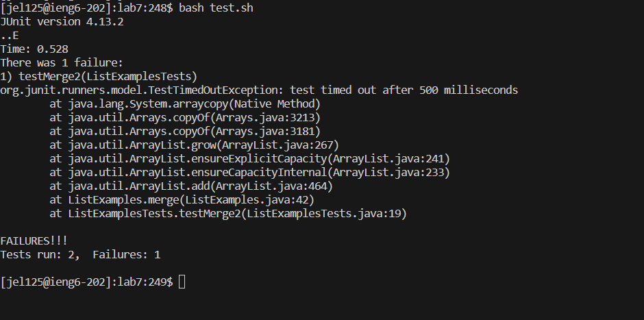
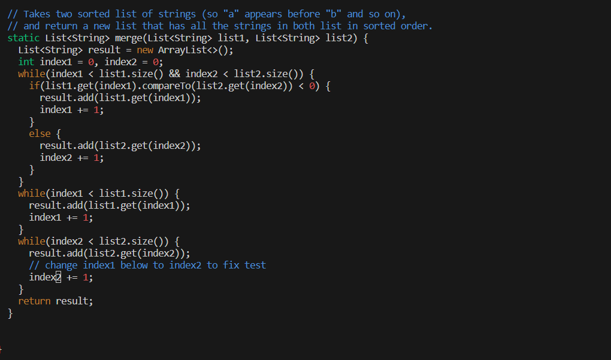

# Step 4 - Log into ```ieng6```

Keys pressed: ```<up> <up> <enter>```

I logged into ```ieng6``` for the previous steps, then logged out so I still have ```ssh jel125@ieng6.ucsd.edu``` in my history 2 commands up. So I used the up arrow to access it quickly and run the command. This logged me into ```ieng6``` as I have an ssh key on my computer and do not need to type the password in.


# Step 5 - Clone your fork of the repository from your Github account (using the SSH URL)

I went to my fork of the repository, clicked the green ```<> Code``` button, went to the ```SSH``` tab and used the copy shortcut ```<CTRL> C``` to copy the link.

Then I went to my terminal and pressed the following keys.

Keys pressed: ```g i t <space> c l o n e <CTRL> V <enter>```


# Step 6 - Run the tests, demonstrating that they fail

Keys pressed: ```c d <space> l a b 7 <enter> b a s h <space> t e s t . s h <enter>```

Here I changed my directory to lab7 using ```cd``` and then ran the ```test.sh``` bash file using ```bash```, which ran the tests. The image below demonstrates the results of the test, which shows that there was 1 failure.



# Step 7 - Edit the code file to fix the failing test

Keys pressed: ```v i m <space> L i s t e x a m p l e s . <tab> <enter>```

This put me into the ```vim``` text editor for the file ```ListExamples.java```. What it looks like is shown below.and it shows that my position is on the bottom of the file. 


Then I pressed:

Keys pressed: ```<up> 6 e r 2 <esc> : w q <enter>```

This allowed me to move my cursor position to the required position, went into replace mode, and replaced ```1``` at the end of ```index1``` with ```2```. Then I save and exited ```vim```. The image below shows my cursor position after I replaced and before I escaped to normal mode and saved and exited ```vim```.



# Step 8 - Run the tests, demonstrating that they now succeed

Keys pressed: ```b a s h <space> t e s t . s h <enter>```

Again, I used ```bash``` to run the tests, this time successful after I edited the file using ```vim```.


# Step 9 - Commit and push the resulting change to your Github account (you can pick any commit message!)

Keys pressed: ```g i t <space> a d d <space> - - a l l <enter> g i t <space> c o m m i t <space> - m <space> " c o m m i t <space> m e s s a g e <space> o r <space> s o m e t h i n g " <enter>```

Here, I added all the files to the list of files for ```git``` to track, then commited all of the changes using ```git commit``` using the message "commit message or something".


Then I copied my authentication token from github and did:

Keys pressed: ```g i t <space> p u s h <enter> d e r p A m a z i n g <enter> <CTRL> V <enter>```

This pushed my changes to my repository.


